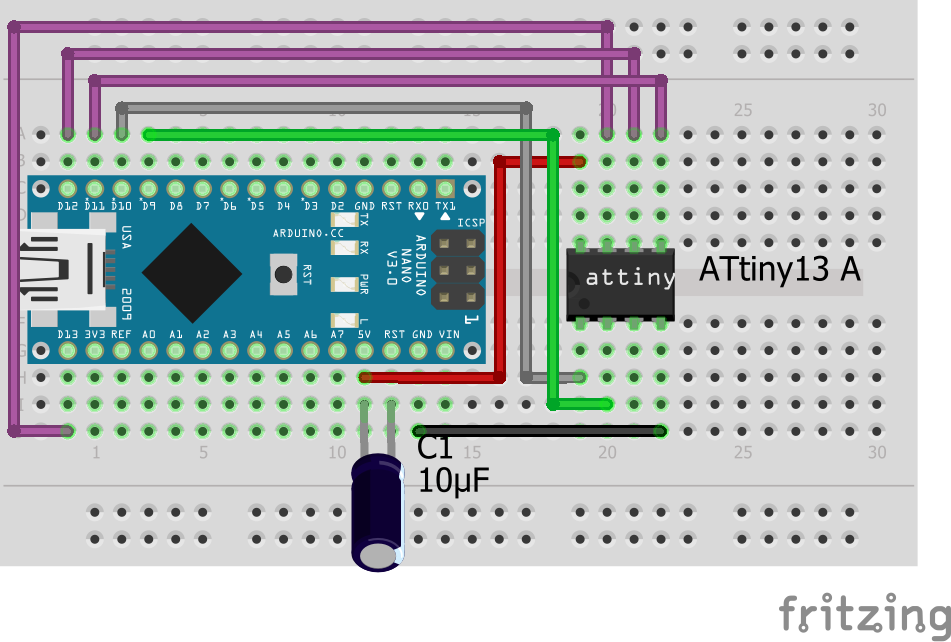
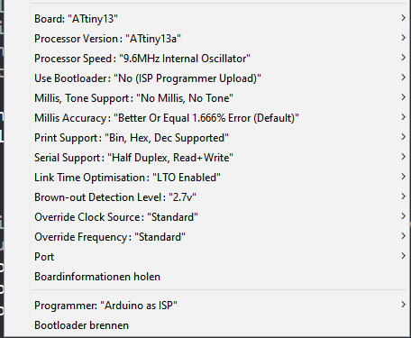
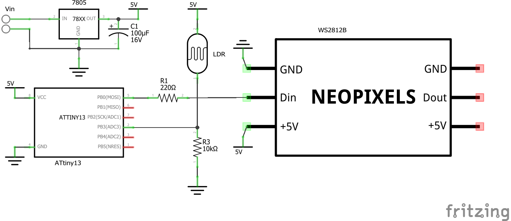
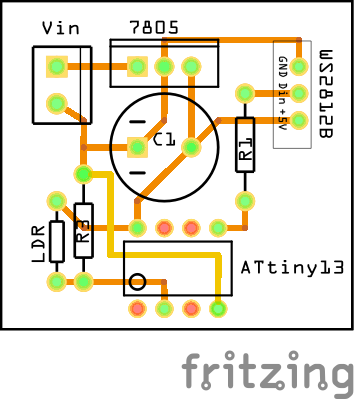

# ATtiny 13 WS2812B-LED Fire-Effect Garden Lamp
This is how you can build a Garden Lamp based on an ATtiny13 and some WS2812B (Neopixel) LEDs.
The LEDs are Simulating a nice-looking Fire-Effect. This effect is generated using a random number generator.
It also features a LDR Light-Sensor to turn on the Lamp in the Darkness automatically.
In the code you can set a time after which the lamp automatically turns off, even if it is still dark. 

# Software
The software is based on several different code snippets. You can find links to them in the Sources-Tab.
There are a view different configuration options (like on-time, color, ...), which can be done in the `config.h` file. They are well described in this file. 

### Features
1. Fire-Effect turns on when LDR-value gets under `on_val` as defined
2. Second state is entered after the timeout `max_on_time` is reached. The LEDs light in the color, defined as `timeout_...`.
3. If it gets light again the LEDs light in the color, defined as `day_...`. If you want it to be off, set all values to 0.

## Program the ATtiny
### 1. Upload `ArduinoISP` sketch to the Arduino
   You can find it in the Examples folder of the Arduino-IDE

### 2. wiring
   I use a Arduino Nano to program the ATtiny, but also a Arduino UNO will do fine. Hook up the ATtiny like it is shown in the schematic:
   
   The capacitor is important because it prevents the Arduino from resetting itself while programming the ATtiny.

### 3. Download ATtiny13 support for the IDE
   Add the URL `http://drazzy.com/package_drazzy.com_index.json` to the Additional Boards Manager URLs in the IDE Preferences. After that open the Boards-Manager, search for "DIY Attiny" and install it. Now you should find the Attiny13 and some other Attiny Boards in the Board menu.

### 4. Uploading
  Open the code in the Arduino IDE and select the Attiny13 as the Board.
  Select the following settings:
  
  
  These settings are important:
  - Processor-Speed to 9.6 Mhz
  - Millis, Tone Support to "No Millis, No Tone"
   
   **After that Press `Burn Bootloader` to make sure that these Settings are applied.**

   Now you can upload the code by simply pressing **Upload**.

# Hardware
## Schematic

## PCB Layout

## ATtiny-Pinout

 (Source: https://cdn.sparkfun.com/assets/f/8/f/d/9/52713d5b757b7fc0658b4567.png)

# Sources / Useful Links
You can find more detailed information here:
- Arduino ISP: https://www.instructables.com/Updated-Guide-on-How-to-Program-an-Attiny13-or-13a/
- Light sensor: https://www.elec-cafe.com/attiny85-light-sensor-switch/
- Timer Interrupt:    https://arduinodiy.wordpress.com/2015/06/22/flashing-an-led-with-attiny13/
- WS2812B Lib:  
  - https://blog.podkalicki.com/attiny13-controlling-leds-ws2811ws2812/
  - https://www.instructables.com/Updated-Guide-on-How-to-Program-an-Attiny13-or-13a/
- Random number gernerator lib:   
  - https://blog.podkalicki.com/attiny13-pseudo-random-numbers/
  - https://github.com/lpodkalicki/blog/tree/master/avr/attiny13/009_lightweigth_prng_based_on_lfsr
- Fire Effect:
  - https://codebender.cc/sketch:271084#Neopixel%20Flames.ino
  - WS2812FX-Lib, "Fire-Flicker" Effect: https://github.com/kitesurfer1404/WS2812FX

 

### I hope you like this project!

 

This work by Dustin Brunner is licensed under <a rel="license" href="https://creativecommons.org/licenses/by/4.0">CC BY 4.0</a>

 Dieses Werk von Dustin Brunner ist lizenziert unter einer <a rel="license" href="http://creativecommons.org/licenses/by/4.0/">Creative Commons Namensnennung 4.0 International Lizenz</a>.
